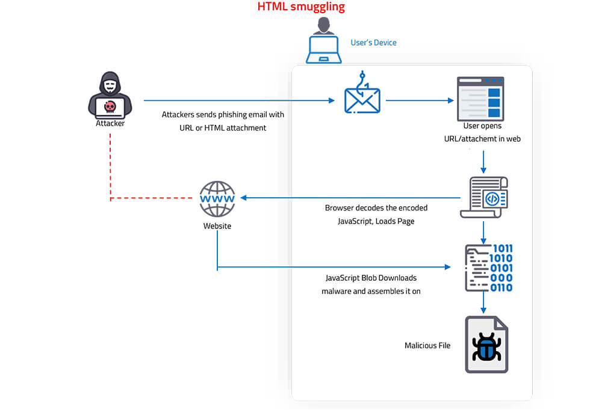
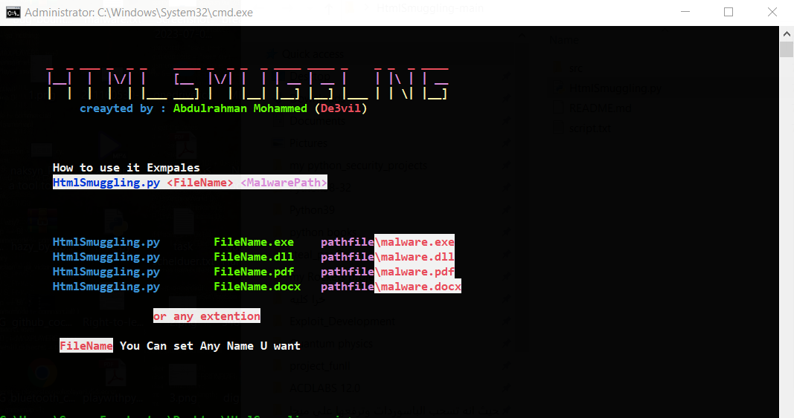

# HtmlSmuggling
* HTML smuggling is a malicious technique used by hackers to hide malware payloads in an encoded script in a specially crafted HTML attachment or   web page. 
* The malicious script decodes and deploys the payload on the targeted device when the victim opens/clicks the HTML attachment/link.
* The HTML smuggling technique leverages legitimate HTML5 and JavaScript features to hide malicious payloads and evade security detections.

* The HTML smuggling method is highly evasive. It could bypass standard perimeter security controls like web proxies and email gateways, which only check for suspicious attachments like `EXE, DLL, ZIP, RAR, DOCX or PDF`
* Embeds the selected binary file `(exe, dll, docx, pdf, etc) `into the Javascript file. Obfuscates Javascript functions. This makes it difficult to decode javascript functions.

* Once a victim receives the email and opens the attachment, their browser decodes and runs the script, which then assembles a malicious payload directly on the victim’s device.
  
* Inspired by : @abdulkadir-gungor


#### Requirements
* python >= 3.8 ++ Download [Python](https://www.python.org/ftp/python/3.8.10/python-3.8.10-amd64.exe)
* os : Windows
* os : Linux
* os : Android (Termux)


### Installation to Windows:
```bash
git clone https://github.com/De3vil/HtmlSmuggling.git
cd HtmlSmuggling
python HtmlSmuggling.py <FileName> <MalwarePath>
```


***
 ## [+] Find Me on :
<h4> Abdulrahman Mohammed </h4>
  <a href="https://www.linkedin.com/in/de3vil/">
     
</a>
  <a href="https://www.facebook.com/De3vil.3">
     
  </a>


If this tool has been useful for you, feel free to thank me by buying me a coffee :)
[](https://www.buymeacoffee.com/De3vil)
 [](https://www.paypal.com/paypalme/De3vil01)
